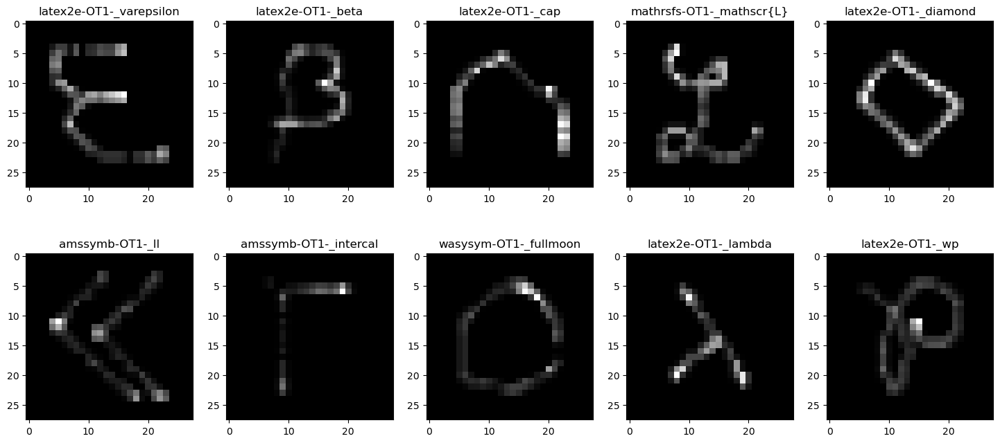

# detexifyasMNIST

This repo aims to provide a way to transform [detexify data](https://github.com/kirel/detexify-data) into a MNIST-like datasets.

The notebook provided here transforms the time series from detexify into *(28,28)* grayscale images.

# Data

The data are available in the [link](https://drive.google.com/drive/folders/0ByuYordD0JBRWXUxRlhEMGtfVVE?resourcekey=0-rYksj_Cs11AMqko9p5swdg&usp=sharing) provided in the [detexify repo](https://github.com/kirel/detexify-data)

# How to use

- Download *detexify.sql* and *symbols.json* from [detexify](https://drive.google.com/drive/folders/0ByuYordD0JBRWXUxRlhEMGtfVVE?resourcekey=0-rYksj_Cs11AMqko9p5swdg&usp=sharing)

- `python3 -m virtualenv venv`

- `source venv/bin/activate`

- `python3 -m pip install --no-cache-dir -r requirements.txt`

- `python3 detexify.py`

# LICENSE

The code is licensed under the [MIT license](LICENSE), the derivative dataset is licensed under the ODC Open Database License (ODbL) ([download a copy](ODBL.txt)) license in according to the original licensing of the data.